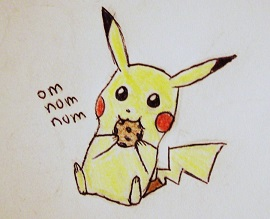

## Learning Objective
We will be calculating a statistical value and using a table to determine the
probability that any difference between observed data and expected data is 
due to chance alone.

## Background Information
Have you ever wondered why the package of M&Ms you just bought never seems to
have enough of your favorite color?  How do they determine what colors go in
each bag? Up until 2008 the Mars company [posted](https://www.exeter.edu/documents/mandm.pdf) 
the percentages of each color M&M that should be in each bag. 

> M&M'S MILK CHOCOLATE: 24% cyan blue, 20% orange, 16% green,
  14% bright yellow, 13% red, 13% brown.

In this lab we will conduct a formal statistical test to assess if the color 
distribution has not changed since reported in 2008.

## Overview
* Update the author name, title and date of this document. 
* Answer the questions throughout the lab in this document. 
* Use the Google Sheet to collect data and to calculate the $\chi^{2}$ test
  statistic. Use R to calculate a p-value for your group's test.  
* Transfer class total information back into R and conduct a class-level test. 

## Setup / Preparation. 
1. Is this a Test of Independence, a Test of Homogeneity or a test for Goodness of Fit?
Explain. 

2. State the null and alternative hypothesis. 

3. Write the equation to determine the test statistic. Recall you can use [Math in 
   Markdown](http://csrgxtu.github.io/2015/03/20/Writing-Mathematic-Fomulars-in-Markdown/).
   
   
4.	In what case would you accept or reject the null hypothesis? 

## Procedure 

1. Put down a piece of paper to sort the M&M's on.
2. Open up a bag of M&M's and empty out onto the paper. 
3. DO NOT EAT ANY YET!
4. Separate the M&M's into color categories and count the number of each color of M&M you have.  
5. Record your data in the 
   [Google Sheets](https://docs.google.com/spreadsheets/d/1-8omq8l0NFhBV8ifJgHerM_3CJSGZknUMHk8wJUGEuQ/edit#gid=0) 
   for your group -- **In the non-shaded cells.** 
6. You may now eat the M&M's.    
      
   _(Delete the image link in the RMD file before you knit)_
7. Write equations in the **shaded cells** to perform the necessary calculations.

## Calculating probabilities under a $\chi^{2}$ distribution in R. 
The function `pchisq(x, df)` returns the probability below $x$ under a $\chi^{2}_{df}$ distribution.
Ex:

1. Calculate the p-value for your group's bag. 

2. Write a conclusion from this hypothesis test.  

## Performing the entire test in R. 
Create a matrix in R that contains the total observed counts for the entire class. 
Use `prop.table()` to conduct a $\chi^{2}$ GoF test to test the manufacturers claim 
that the distribution of colors is as claimed. _Hint: Look at `?prop.test()` to find
out how to supply this function a **vector of probabilities of success**._

1. Based on the class data what can you conclude about the color distribution of M & M's?

2.	Were your calculated chi square values consistent between your individual and the class data?
Why do you believe this to be true?

  

#### References
* Google Sheet for Data Collection: https://docs.google.com/spreadsheets/d/1-8omq8l0NFhBV8ifJgHerM_3CJSGZknUMHk8wJUGEuQ/edit#gid=0 
* Color distribution: https://www.exeter.edu/documents/mandm.pdf
* Pikachu http://crazykitty9.deviantart.com/art/pikachu-nomming-on-a-cookie-317600850
* Math in Markdown: http://csrgxtu.github.io/2015/03/20/Writing-Mathematic-Fomulars-in-Markdown/ 