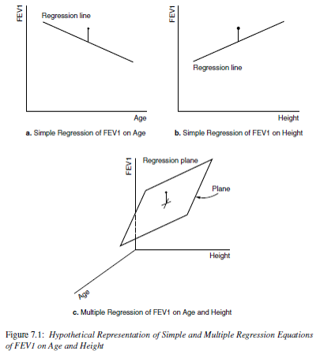

```{r,echo=FALSE, warning=FALSE, message=FALSE}
library(knitr); library(rmarkdown);
opts_chunk$set(warning=FALSE, message=FALSE) 
```

```{r results="asis", echo=FALSE}
source("C:/Github/MATH456/stylesheets/custom.R")
```

Navbar: [[Home]](../index.html) [[Schedule]](../Schedule.html) [[Week 3 Overview]](../wk03.html) [[HW Rubric]](../admin/rubric.html)  [[Google Group]](https://groups.google.com/forum/#!forum/csuc_stat)  [[Google Drive]](https://drive.google.com/a/mail.csuchico.edu/folderview?id=0B83Z8_sNw3KPcnVrYzVFRHUtcHM&usp=sharing)

# Assigned Reading
Afifi: Chapters 6-7

# Simple Regression and Correlation (_Afifi Ch 6_)

## Aims
* Describe the relationship between an independent variable X and a continuous
  dependent variable $Y$ as a straight line. The textbook discusses two cases: 
    - Fixed-$X$: values of $X$ are preselected by investigator
    - Variable-$X$: have random sample of $(X,Y)$ values
    - Calculations are the same, 
* Draw inferences regarding this relationship
* Predict value of $Y$ for a given value of $X$

## Mathmatical Model
* The mean of $Y$ values at any given $X$ is $\beta_{0} + \beta_{1} X$
* The variance of $Y$ values at any $X$ is $\sigma^2$ (same for all X)
* $Y$ values are normally distributed at any given $X$ (need for inference)


## Parameter Estimates
* Estimate the slope $\beta_{1}$ and intercept $\beta_{0}$ using least-squares methods.
* The residual mean squared error (RMSE) is an estimate of the variance $s^{2}$
* Typically interested in inference on $\beta_{1}$
    - Assume no relationship between $X$ and $Y$ $(H_{0}: \beta_{1}=0)$ 
      until there is reason to believe there is one 
      $(H_{0}: \beta_{1} \neq 0)$

## Interval estimation
* Everything is estimated with some degree of error
* Confidence intervals for the mean of $Y$
* Prediction intervals for an individual $Y$ 

Which one is wider? Why?

## Corelation Coefficient
* The correlation coefficient $\rho$ measures the strength of association
  between $X$ and $Y$ in the _population_.
* $\sigma^{2} = VAR(Y|X)$ is the variance of $Y$ for a specific $X$.
* $\sigma_{y}^{2} = VAR(Y)$ is the variance of $Y$ for all $X$'s.

$$ \sigma^{2} = \sigma_{y}^{2}(1-\rho^{2})$$
$$ \rho^{2} = \frac{\sigma_{y}^{2} - \sigma^{2}}{\sigma_{y}^{2}}$$

* $\rho^{2}$ = reduction in variance of Y associated with knowledge of X/original variance of Y
* **Coefficient of Determiniation**: $100\rho^{2}$ = % of variance of Y associated with X or explained by X
* Caution: association vs. causation.

### Example: Lung Function
_Note: The data management markdown file for this data set can be found [here](../data/dm_lung.Rmd).
you will need to download the raw data, and this data management file, update the file locations
and run it on your machine to create the analysis data set._

_Section 6.3_
1. Read in the analysis data set for the lung function. 
```{r}
fev <- read.delim("C:/GitHub/MATH456/data/Lung_020716.txt", sep="\t", header=TRUE)
```

2. Create a scatterplot of FEV versus height for fathers. 
   Add a blue linear regression line and red lowess line.
   Add appropriate plot titles and axes labels.
   [R Cookbook reference](http://www.cookbook-r.com/Graphs/Scatterplots_(ggplot2)/)

```{r}
library(ggplot2)
qplot(y=FFEV1, x=FHEIGHT, geom="point", data=fev, xlab="Height", ylab="FEV1", 
      main="Scatter Diagram with Regression (blue) and Lowess (red) Lines 
      of FEV1 Versus Height for Fathers.") + 
      geom_smooth(method="lm", se=FALSE, col="blue") + 
      geom_smooth(se=FALSE, col="red") 
```

There does appear to be a tendency for taller men to have higher FEV1. 

3. Fit a linear model and report the regression parameter estimates. 
```{r}
model <- lm(FFEV1 ~ FHEIGHT, data=fev)
summary(model)
```
The least squares equation is $Y = -4.087 + 0.118X$.

4. Test for a significant relationship between height and FEV. Include a p-value and 
a confidence interval for the parameter estimate in your conclusion. 
```{r}
confint(model)
```
For ever inch taller a father is, his FEV1 measurement significantly increases by .12 (95%CI: .09, .15, p<.0001).  
The correlation between FEV1 and height is $\sqrt{.2544}$ = 0.5. 

5. Predict the FEV for a 6' and 6'4" male. 
```{r}
newdata <- data.frame(FHEIGHT=c(72, 76))
predict(model, newdata, interval="confidence")
predict(model, newdata, interval="prediction")
```

Why couldn't I create a prediction for a 5' male (60")? Hint, look at the range of height values below. 
```{r}
summary(fev$FHEIGHT)
```

## Assumptions of Linear Regression
* Homogeneity of variance (same $\sigma^{2}$)
    - Not extremely serious
    - Can use transformations to achieve it
    - Graphical assessment: Plot the residuals against the x variable, add a lowess line. 
      This assumption is upheld if there is no relationship/trend between the residuals and
      the predictor. 
```{r}
plot(model$residuals ~ fev$FHEIGHT)
lines(lowess(model$residuals ~ fev$FHEIGHT), col="red")
```

* Normal residuals
    - Slight departures OK
    - Can use transformations to achieve it
    - Graphical assessment: normal qqplot of the model residuals. 
```{r}
qqnorm(model$residuals)
qqline(model$residuals, col="red")
```
    
* Randomness / Independence
    - Very serious
    - Can use hierarchical models for clustered samples
    - Graphical assessment: Plot the residuals against the index (row number), add a lowess line. 
      This assumption **may** upheld if there is no relationship/trend seen. 
```{r}
plot(model$residuals)
lines(lowess(model$residuals ~ 1:NROW(fev)), col="red")
```
    
* Linear relationship
    - Slight departures OK
    - Can use transformations to achieve it
    - Graphical assessment: Simple scatterplot of $y$ vs $x$. 
      Looking for linearity in the relationship. 
      Should be done prior to any analysis. 
```{r}
plot(fev$FFEV1 ~ fev$FHEIGHT)
lines(lowess(fev$FFEV1 ~ fev$FHEIGH), col="red")
```


Some of these plots can be displayed by simply plotting the model
output. The advantage of this is that the observations that are
potential outliers are labeled with their row number.
```{r, fig.height=8, fig.width=8}
par(mfrow=c(2,2))
plot(model)
```


## What to watch out for
* Representative sample 
* Range of prediction should match observed range of X in sample
* Use of nominal or ordinal, rather than interval or ratio data
* Errors-in-variables
* Correlation does not imply causation 
* Violation of assumptions
* Influential points
* Appropriate model


The book goes into more detail about influential points, and how
outliers can have different affects on the model results depending
on if they are an outlier in $Y$ vs an outlier in $X$ (or both). 


##### On Your Own: Afifi Problem 6.2 (modified). 
Write your responses in a new Markdown file named *userid_ch6.rmd*.
Don't forget to use the _analysis_ data set for this problem. 

1. Perform a regression analysis of weight on height for fathers  
     a. Determine the correlation coefficient and the regression equation.   
     b. Interpret the coefficients in context of the problem.   
2. Test that the coeffcients are significantly different from zero. 
3. Assess model fit graphically. Comment on any outliers. 
4. Repeat 1 -3 for mothers.   
5. Discuss why the correlation for fathers appears higher than that for mothers.


# Multiple Regression and Correlation (_Afifi Ch 7_)

## Aims
* Extend simple linear regression.
* Describe linear relationship between a single continuous $Y$ variable, 
  and several $X$ variables.
* Draw inferences regarding this relationship.
* Predict $Y$ from $X_{1}, X_{2}, \ldots , X_{P}$.

Now it's no longer a 2D regression _line_, but a $p$ dimensional 
regression plane. 



## Mathematical Model
* Mean of $Y$ values at any given $X$ is: $\alpha + \beta_{1}x_{1} + \ldots + \beta_{p}x_{p}$
* Variance of $Y$ values at any set of values of $X$'s is $\sigma^2$ (same
  for all X's)
* $Y$ values are normally distributed at any given $X$ (need for inference)

## Types of X variables
* Fixed: selected in advance
* Variable: as in most health science studies
* X's can be continuous or discrete (categorical)
* X's can be transformations of other X's, e.g., polynomial regression

### Continued Example: Lung Function
In Chapter 6 the data for fathers from the lung function data set were 
analyzed. These data fit the variable-X case. Height was used as the 
$X$ variable in order to predict `FEV`. 
```{r}
model <- lm(FFEV1 ~ FHEIGHT , data=fev)
summary(model)
```
This output shows that height is significantly associated with FEV, 
specifically as height increases so does FEV (p<.0001). Looking
at the multiple $R^{2}$ (correlation of determination), this simple
model explains 25% of the variance seen in the outcome $Y$. 


However, FEV tends to decrease with age for adults, so we should be able
to predict it better if we use both height and age as independent variables
in a multiple regresison equation. 

First let's see different ways to graphically explore the relationship between
three characteristics simultaneiously.

#### 3D scatterplots
```{r}
library(scatterplot3d)
scatterplot3d(x=fev$FHEIGHT, y=fev$FAGE, z=fev$FFEV1, 
              xlab="Height", ylab="Age", zlab="FEV", 
              main="Relationship between FEV1, height and age for fathers.")
```

See http://www.statmethods.net/graphs/scatterplot.html for two simple ways to
create interactive, spinning 3D scatterplots. 

#### Controlling the color, or size of points using the third characteristic
```{r, fig.width=10}
library(gridExtra)
a <- qplot(y=FFEV1, x=FAGE, color=FHEIGHT, data=fev)
b <- qplot(y=FFEV1, x=FHEIGHT, size=FAGE, data=fev)
grid.arrange(a, b, ncol=2)
```

The scatterplot of FEV against age demonstrates the decreasing trend of
FEV as age increases, and the increasing trend of FEV as height increases. 
The third color however is pretty scattered across the plot. There is no
obvious trend observed.

*  What direction do you expect the slope coefficient for age to be? For height? 

```{r}
model <- lm(FFEV1 ~ FHEIGHT + FAGE, data=fev)
summary(model)
```

Both height and age are significantly associated with FEV in fathers (p<.0001 each).
Was our model improved by the addition of this variable? Let's check the $R^{2}$. 
Recall this is calculated as the amount of variance explained by the model divided
by the total variance. 
```{r}
summary(aov(model))
(16.05317+5.00380)/(16.05317+5.00380+42.04133)
```
This number is displayed as the **Multiple R-squared** value in the linear model 
output. But what about that other value, the **Adjusted R-squared**? Observe
what happens to these two variables when we put a variable into the model
that is not associated with the outcome, mothers weight.

```{r}
summary(lm(FFEV1 ~ FHEIGHT + FAGE + MWEIGHT, data=fev))
```

Adding more predictors to the model will always increase the $R^{2}$!

**Adjusted R^{2}**
$$ 1 - (1-R^{2})\frac{n-1}{n-p-1} $$


## Values of regression coefficients
* Problem: Values of $B_{i}$’s are NOT directly comparable.
* Solution: Standardized coefficients:
$$B_{i} = B_{i} \frac{\sigma_{x_{i}}}{\sigma_{Y}}$$


##### On Your Own
Write your responses in a new Markdown file named *userid_ch7.rmd*.

-->
